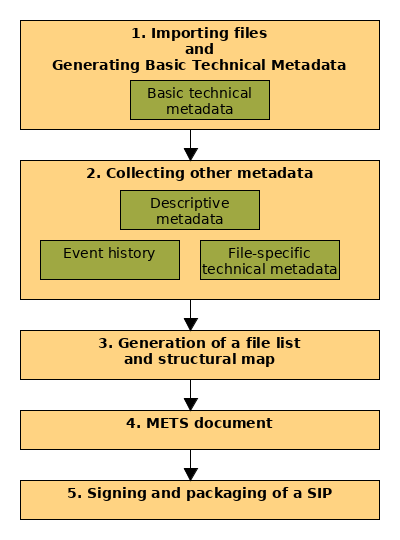
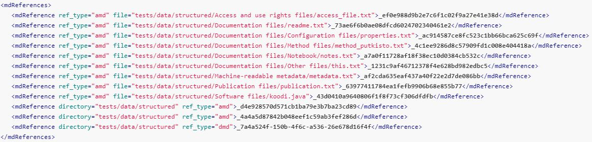

Ingest Tool - a Tool Package for Generating a Valid Submission Information Package (SIP)
========================================================================================

The pre-ingest tool of the Digital Preservation Service (DPS) is intended for facilitating 
the generation of a valid SIP following the specifications. The SIP packaging with the pre-ingest tool 
contains five main steps (Figure 1):

1) Importing objects and generating basic technical metadata, 
2) Collecting other metadata, 
3) Generation of a file list, structure and links between metadata and files, 
4) Compiling of a METS document and 
5) Signing of a SIP and packaging.

   **Figure 1**. The workflow for generating a SIP with the pre-ingest tool.
 

The pre-ingest tool accepts all the file formats described in the DPS `file format specifications`_. 
Metadata of a SIP applies multiple international metadata standards. Each of these standards 
is designated for a certain type of metadata.

The scripts of the pre-ingest tool may be used independently only for some parts of a SIP 
or for generating the entire SIP. Metadata of a SIP applies multiple international metadata 
standards. Each of these standards is designated for a certain type of metadata.

.. _file format specifications: http://digitalpreservation.fi/

Step 1: Importing Files to Digital Objects and Generating Basic Technical Metadata
----------------------------------------------------------------------------------

In the importing step the files are imported to digital objects and the `PREMIS`_ (an international
standard for metadata) formed metadata is created. This basic technical metadata 
includes charset, file format, identifier, checksum, date when the data was created and format 
registry. If the basic technical metadata is not given, the metadata for charset, identifier, 
file format, checksum and date_created will be generated automatically.  

The pre-ingest tool can accept a wide range of files that are described in the `file format specifications`_.
The pre-ingest tool uses a `file-scraper library`_ to recognise mimetype and version metadata, if 
they are not given as parameters. For video containers that have several video and audio streams,
mimetypes and versions are collected separately for each stream. The file-scraper library also validates 
the imported file, if this step is not prevented in the skip_wellformed_check parameter.

The filename in this step (as well as in the later steps) is a relative path to the directory in which 
the METS document is located. However, an optional --base_path parameter allows using an absolute path. 
In this case, the filenames has to be given as relative paths to the base_path parameter. 

.. _PREMIS: https://www.loc.gov/standards/premis/
.. _file-scraper library:  https://github.com/Digital-Preservation-Finland/file-scraper

Step 2: Collecting Other Metadata
---------------------------------

Steps 1 and 2 create temporary files in the given workspace. These files contain the created and/or 
collected XML metadata in METS wrappers containing the internal METS IDs (DMDID, AMDID). These temporary
files are compiled into one METS file in step 4 (compile-mets). A temporary linking file, 
md-references.xml (Figure 2), needed for constructing the structural map in step 3, is also created in 
the workspace. The linking file contains METS IDs corresponding to the previously created temporary 
METS files as well as paths to the digital objects or folders in the package. File type links are added
to the fileSec in the METS document, while directory type links are added to the structMap section of 
the METS.

   **Figure 2.** Example of md-references.xml file.

**File-Specific Technical Metadata**

Different file formats have have different requirements for collection of technical metadata (Table 1).
For instance, image file metadata requires the width and height of the image and colour code. 
The pre-ingest tool collects the needed metadata automatically applying the `file-scraper library`_. 
The applied script of a pre-ingest tool and the standard of the file-specific technical metadata 
depends on the file format. In the case of video containers having audio and video streams, 
the metadata has to be created separately for each stream type.

**Table 1.** File formats and collected metadata.

+------------------------------+-------------------------------------------+--------------------+
| File Format                  | Collected metadata                        | Applied Standard   |
|                              |                                           |                    |
+==============================+===========================================+====================+
| Audio Files                  | - Application for creating codec          |                    |
|                              | - Application version for creating codec  |                    |
|                              | - Codec name                              |                    |   
|                              | - Codec quality (lossy or lossless codec) | AudioMD_           |
|                              | - Duration                                |                    |
|                              | - Number of channels                      |                    |
+------------------------------+-------------------------------------------+--------------------+   
| Image Files                  | - Bits per sample                         |                    |
|                              |  (bits per sample value,                  |                    |
|                              |  bits per sample unit,                    |                    |
|                              |  samples per pixel)                       |                    | 
|                              | - Bytes order                             |                    |
|                              | - Colour encoding                         |  MIX_              | 
|                              | - Colour space                            |                    | 
|                              | - Height                                  |                    |  
|                              | - Width                                   |                    |
+------------------------------+-------------------------------------------+--------------------+
| Structural text (CSV) Files  | - Description                             |                    |
|                              | - Reference                               |                    |
|                              | - Field Definitions                       |  ADDML             |
+------------------------------+-------------------------------------------+--------------------+
| Video Files                  | - Application for creating codec          |                    |
|                              | - Application version for creating codec  |                    |
|                              | - Codec name                              |                    |
|                              | - Codec quality                           |                    |
|                              | - Display Aspect Ratio                    |  VideoMD_          |
|                              | - Pixel aspect ratio                      |                    |
+------------------------------+-------------------------------------------+--------------------+

.. _AudioMD: https://www.loc.gov/standards/amdvmd/
.. _MIX: http://www.loc.gov/standards/mix/
.. _VideoMD: https://www.loc.gov/standards/amdvmd/ 

**Event History**

The minimum `event history`_ is the creation date of the data. The event history improves reliability of 
the data, because it allows data processing being traced. For example, if data is digitized, the event 
history could include the name of the person who digitized data, time of digitization, the label and 
model of a scanner or camera, settings and all steps in digitization. It is important that events are 
documented and saved as early as possible, because tracing of them may be difficult afterwards.

The event history tool adds a `PREMIS`_ formatted event and agent to the METS document based on the 
user's input and creates a unique identifier for each event. The premis:event includes information 
about what has been done and premis:agent who/what performed the event. The created event is for 
the whole SIP by default. If the event is only for a single file --event_target parameter should be 
used.

.. _event history: http://digitalpreservation.fi

**Descriptive Metadata**

`Descriptive metadata`_ cannot be produced automatically and the user has to create a XML-formatted 
metadata by oneself. The pre-ingest tool has a script to import XML-formatted descriptive information.
It creates an METS element tree and includes descriptive information to the `dmdSec`_ element.
The description is for the whole SIP, however, the description can be targetted to a certain file 
by using --dmd_target parameter.

.. _Descriptive metadata: http://digitalpreservation.fi
.. _dmdSec: http://digitalpreservation.fi

Step 3: File List and a Structural Map
--------------------------------------

A structural map (`structMap`_ element) and file list (`fileSec`_ element) describe the hierarchical 
structure of files in a SIP and it also links files and the related metadata together. The structural map
is created based on the structural map type that is given as a parameter. At the moment only two simple
structural maps are supported. They are standard and physical directory structure. Both fileSec and
structural map are created separately for these two types of structural maps. The information about 
the filepaths, metadata type and linking metadata are read from the md-references.xml file that is 
created and updated when digital objects are imported (step 1), and events and descriptions created (step 2).

.. _structMap: http://digitalpreservation.fi
.. _fileSec: http://digitalpreservation.fi
.. _EAD3: http://www.loc.gov/ead/

*Physical Directory Structure*

The creation of the `fileSec`_ element is started by grouping files under the `fileGrp`_ element based on
the file paths of digital objects. These fileGrp elements are combined under the fileSec element. 
The file elements (describing file properties) are added under the fileGrp elements at the same time
with the creation of `div`_ elements. If a path is a file, a file element and file properties are
added under the fileSec element, also a ftpr (a file pointer) list is collected. If a file path is not
a file, a div element is created. The div contains an identifier to the `dmdSec`_ (descriptive metadata) 
as well as to administrative metadata. At the end ftpr elements are added to the file division elements 
that links digital objects to div element. At the end, div elements are collected under a structmap element.

.. _fileGrp: http://digitalpreservation.fi
.. _div: http://digitalpreservation.fi
 

*EAD3 Structure*

In the case of `EAD3`_ structural map, the structure is based on the digital access object (dao) elements.
At first the `div`_ elements are created based on the name tags in the EAD3 metadata. Then the sets of dao 
are extracted from the EAD3 metadata and from these, hrefs are collected. The files are grouped and added
to the `fileSec`_ based on the hrefs and at the same time file pointers are added to the div elements.   

Step 4: METS Document
---------------------

At this point the created metadata is still scattered in the workspace and they need to be merged into
one METS document. The Mets-compiling component in the pre-ingest tool merges previously created
`dmdSec`_, `amdSec`_, `fileSec`_ and `structMap`_ elements. In addition, `metsHdr`_ is created that 
is based on the user's input.

.. _amdSec: http://digitalpreservation.fi
.. _metsHdr: http://digitalpreservation.fi

Step 5: Signing and Packaging a SIP
-----------------------------------

Finally, the SIP is signed with a digital signature and compressed into a .tar file. This step is
similar to a 'tar' Linux command that can be used instead of the compress script of the pre-ingest
tool.

